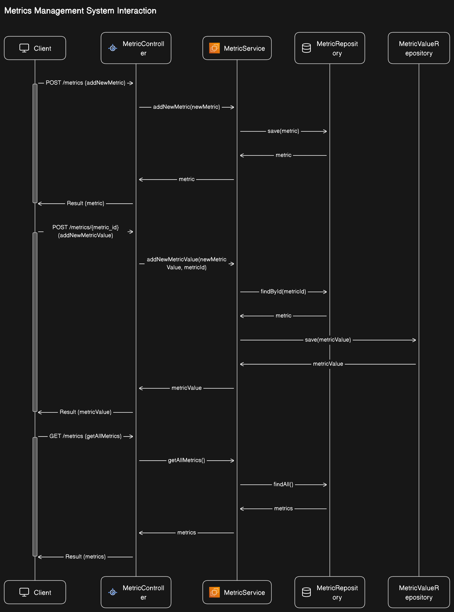

# performance-metrics

An application to monitor performance metrics.

## Features
- Add a Metric 
- Add values and timestamps to a Metric
- View all metrics and their averages per minute/hour/day

## Tech Stack
- Backend
  - SpringBoot - Java 
  - MySQL
  
- Android
  - Kotlin
  - XML
## Run
- Backend
   - Clone and open `performance-metrics-java` 
   - Create `MySQL` database
   - Setup `application.yml` environment variables
- Android
  - Clone and cd `performance-metrics-android`
  - Open with android studio
  - Change API base url to your local IP   

   
## Challenges Addressed
### Calculating Averages
Calculating the metric values average is the task I was most focused on. Following are the possible methods we can use to address this task.

#### Dynamic Method (Calculate on each GET request)
Calculate the average every time the user makes a GET request. This will involve retrieving data from the database, calculating the average either manually or through SQL queries, and appending it to the request-response. This approach provides real-time average calculations based on the most recent data but may lead to increased response times and server load, especially with large datasets.

#### Store Averages in the Database: 

This method will work by calculating the average every time a user adds a new metric value to the database. Calculated averages are readily available, reducing the need for frequent recalculations. But maintenance becomes more complex as it involves updating averages whenever new data is added or existing data is modified.

#### Client-side Method (Calculate on the User's Machine) - Current Approach: 

Calculate the averages on the user's machine right when the user is viewing the data. This reduces the server's computational load, improving server performance and decreased request time. But implementing updates or changes to the calculation logic requires distributing updates to all clients, which can be challenging compared to server-side updates.

## Planned Improvments
- Added graph charts to show metric values for each metric list item
- Create separate screens for adding a new Metric and Metric values
- Pagination to handle large datasets
- Ability to view metric values in a range
